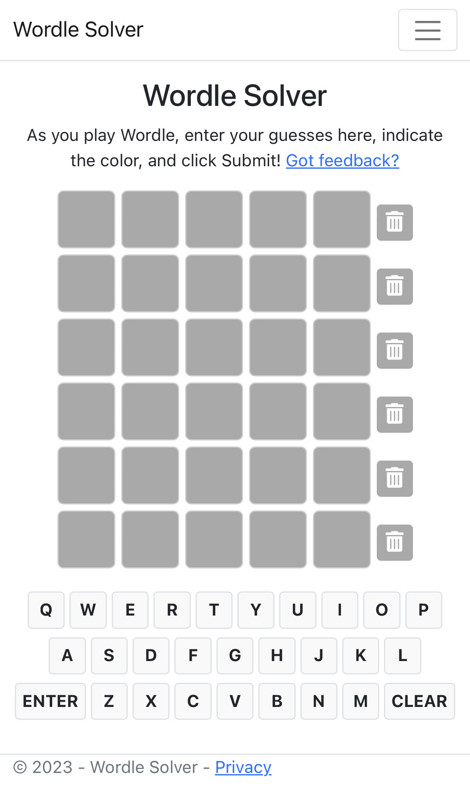
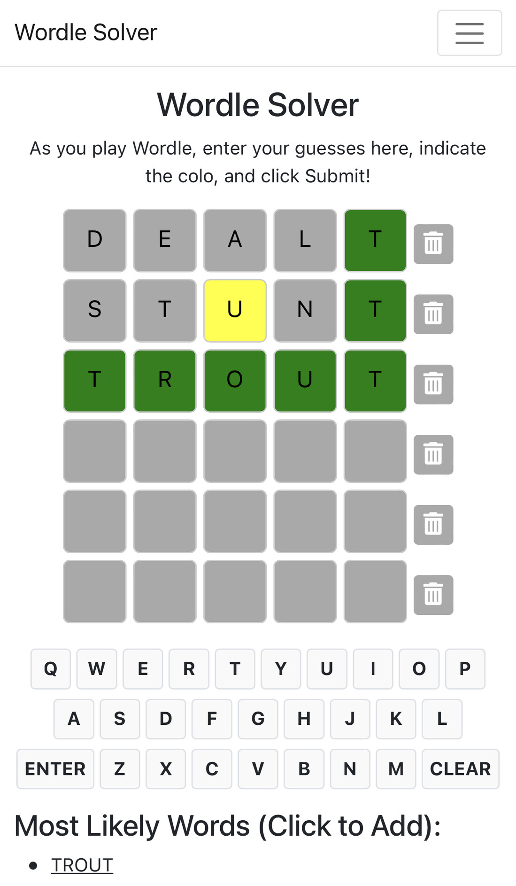

# Wordle Wizard

Wordle Wizard is an ASP.NET Blazor application that helps players solve the popular Wordle game by providing the most likely words based on the user's previous guesses and their corresponding color indications.

[Try it right now!](https://wordlesolver.herokuapp.com/)

| Initial Screen  | After Submission |
| --- | --- |
|  |  |

## Features

- Allows users to enter their Wordle guesses and indicate their color (green, yellow, or dark grey) by double-clicking the letter.
- Automatically suggests the top 10 most likely words based on the user's input history.
- Users can insert a suggested word directly into an empty row with a single click.
- Provides the option to clear a single row or clear all rows of input.

## Installation

1. Clone the repository:

```bash
git clone https://github.com/wadewegner/wordle-solver.git
```

2. Change the working directory:

```bash
cd wordle-solver
```

3. Install the necessary packages and dependencies:

```bash
dotnet restore
```

4. Build the project:

```bash
dotnet build
```

5. Run the project:

```bash
dotnet run
```

6. Open your browser and navigate to `http://localhost:<PORT>` to start using the Wordle Wizard.

## Usage

1. Start a new game of Wordle (either on the official website or any other platform that offers the game).

2. Input your Wordle guesses in the Wordle Wizard app, indicating their color by double-clicking the letter (green, yellow, or dark grey).

3. Click the `Submit` button to get the next best guess based on your input history.

4. If you want to use a suggested word, simply click on it, and it will be inserted into the next empty row.

5. You can clear a single row by clicking the trash icon, or clear all rows by clicking the `Clear All` button.

6. Repeat steps 2-5 until you have successfully guessed the Wordle word.

## Contributing

Contributions are welcome! Feel free to report any issues or submit pull requests.

1. Fork the repository and create your branch from `main`.
2. Make your changes and commit them.
3. Push your branch and open a pull request.

## License

This project is licensed under the MIT License - see the [LICENSE](LICENSE) file for details.